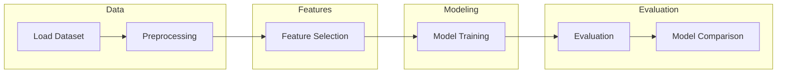

# Dengue Incidence Forecasting using Machine Learning

## Overview
This project predicts dengue cases using machine learning models trained on meteorological data. It explores how environmental factors influence outbreaks and builds a forecasting pipeline for two cities.

---

## Workflow



---

## Dataset

<details>
<summary>View dataset details</summary>

### Source
DrivenData DengAI Dataset  

### Features

| Category        | Variables                          |
|----------------|-----------------------------------|
| Climate        | Temperature, Humidity             |
| Weather        | Precipitation                     |
| Environment    | Vegetation Index                  |
| Location       | City-level data                   |

### Cities

| City       | Country        |
|------------|----------------|
| San Juan   | Puerto Rico    |
| Iquitos    | Peru           |

</details>

---

## Methodology


<details>
<summary>View detailed steps</summary>

### Data Preprocessing
- Missing values handled using mean imputation  
- Temperature unit conversion  
- Rounding for consistency  

### Feature Selection
- Correlation analysis to identify important features  
- Removed negatively correlated and weak features  

### Models Used
- K-Nearest Neighbors (KNN)  
- Random Forest (RF)  
- Gradient Boosting Regressor (GBR)  
- Support Vector Regressor (SVR)  

### Evaluation Metric
- Mean Absolute Error (MAE)  

</details>

---

## Results

### Model Performance (MAE ↓)

| Model | San Juan | Iquitos | Performance |
|------|----------|---------|-------------|
| KNN  | Lowest   | Low     | Best overall |
| RF   | Medium   | Medium  | Stable |
| GBR  | Medium   | Medium  | Comparable |
| SVR  | Low      | Lowest  | Best for Iquitos |

---

### Impact of Feature Selection


- San Juan: 16 → 11 features  
- Iquitos: 16 → 8 features  
- Reduced noise and improved model performance  

---

### Key Findings

- KNN achieved the best overall performance  
- SVR performed best for Iquitos  
- Feature selection significantly improved results  
- Weather variables strongly influence dengue cases  

---

### Final Insight

Lower MAE indicates better prediction accuracy. KNN proved to be the most reliable model for dengue forecasting in this study.

---

## Technologies Used


---

## How to Run

```
git clone <your-repo-link>
cd <project-folder>
pip install -r requirements.txt
python main.py
```

---

## Future Work

- Apply deep learning models  
- Incorporate additional environmental and demographic data  
- Use time-series models such as ARIMA  
- Deploy as a real-time forecasting system  
